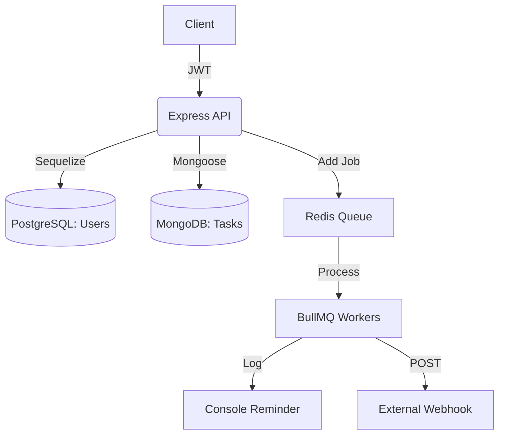

# 🚀 Task Management API — Pro Edition

A high-performance, enterprise-ready RESTful API designed for modern task orchestration. Built with **Node.js**, **Express**, and **BullMQ**, this system offers real-time reminders, advanced categorization, and seamless third-party service integration via webhooks.


---

## ✨ Key Features

### 📅 Real-time Task Reminders
Never miss a deadline. The system utilizes **BullMQ** and **Redis** to schedule micro-notifications exactly 1 hour before a task is due.
- **Smart Scheduling:** Automatically reschedules if task due dates are updated.
- **Auto-Cleanup:** Cancels reminders for completed or deleted tasks.

### 🏷️ Categorization & Tags
Stay organized with dynamic categories and flexible tagging systems.
- **Filtering:** Powerful GET requests support filtering by `categoryId` and multiple `tags`.
- **Hierarchical Layout:** Associate tasks with specific work or personal categories.

### 🔗 Webhook Integration
Automate your workflow by pushing task completion data to external analytics or monitoring services.
- **Reliability:** Built-in **exponential backoff retry logic** (up to 3 attempts).
- **Decoupled Architecture:** Webhook processing happens in the background, keeping the API fast and responsive.

### 🛡️ Robust Security & Validation
- **JWT Authentication:** Secure user-based access control.
- **Joi Validation:** Strict server-side input sanitization.
- **Error Handling:** Centralized, standardized error responses for all scenarios.

---

## 🛠️ Technology Stack

| Layer | Technology |
| :--- | :--- |
| **Backend** | Node.js (Express.js) |
| **User Database** | PostgreSQL (Sequelize ORM) |
| **Task Database** | MongoDB (Mongoose) |
| **Job Queue** | BullMQ + Redis |
| **Validation** | Joi |
| **Documentation** | Swagger / OpenAPI 3.0 |

---

## ⚙️ Quick Start

### 1. Prerequisites
- Docker & Docker Compose
- Node.js (v18+)
- Redis (Optional if running outside Docker)

### 2. Environment Setup
Create a `.env` file in the root directory:
```env
PORT=3000
NODE_ENV=development

# Authentication
JWT_SECRET=your_super_secret_key_here
JWT_EXPIRES_IN=7d

# Databases
PG_DATABASE=task_management
PG_USER=postgres
PG_PASSWORD=postgres
PG_HOST=localhost
PG_PORT=5432

MONGO_URI=mongodb://localhost:27017/task_management

# Background Jobs
REDIS_URL=redis://localhost:6379
WEBHOOK_URL=https://webhook.site/your-unique-id
```

### 3. Launch with Docker
Spin up the entire infrastructure with a single command:
```bash
docker-compose up -d
```

### 4. Install Dependencies & Start
```bash
npm install
npm run dev
```

---

## 📖 API Documentation

Once the server is running, explore the interactive API documentation at:
👉 **[http://localhost:3000/api-docs](http://localhost:3000/api-docs)**

The documentation provides detailed request/response schemas and the ability to test endpoints directly from your browser.

---

## 🏗️ Architecture



---

## 📝 License
This project is licensed under the ISC License.
