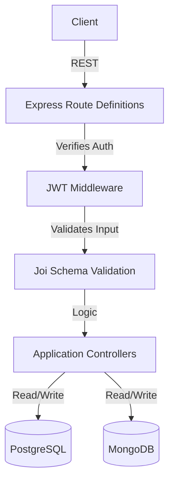

<div align="center">
  
  
  
  
  
  
  
</div>

<h1 align="center">Task Management API</h1>
<p align="center"><strong>A professional, highly-scalable backend API for managing user tasks natively supporting dual-database architecture.</strong></p>

---

## ✨ Key Features
- **Dual-Database Strategy**: Utilizes PostgreSQL (Sequelize) for structured User authentication logic, and MongoDB (Mongoose) for flexible task document tracking.
- **Robust Security**: Enforces stateless JWT payload validation, secure bcrypt password hashing, and endpoint-level user-task ownership controls.
- **Performance Optimized**: Implements cursor-based pagination and flexible database-filtering on aggregate endpoints.
- **Validation**: Strict schema validation using `Joi`.
- **Testing Standard**: Comprehensive integration testing layer with `Jest` supporting fully mocked databases (`sqlite`, `mongodb-memory-server`).
- **DevOps Ready**: Seamless one-click deployment using `Docker Compose`.
- **API Documentation**: Automated, interactive front-end specification via `Swagger UI`.

---

## 🏗️ Architecture



---

## 🚀 Quick Run Guide

### 1. Requirements
Ensure you have the following installed on your machine:
- Node.js (v18+)
- Docker & Docker Compose

### 2. Environment Variables
Copy over the standard implementation variables:
```bash
cp .env.example .env
```

### 3. Start Database Containers
Stand up local instances of PostgreSQL and MongoDB mapping to your default ports:
```bash
docker-compose up -d
```

### 4. Running the Development Server
Install application dependencies and boot up your Express cluster:
```bash
npm install
npm run dev
```

> **API Server Live**: `http://localhost:3000`
> **Interactive Swagger Specs**: `http://localhost:3000/api-docs`

---

## 🧪 Testing
The testing suite builds completely separated in-memory variants of our databases securely avoiding bleeding integration logic.

```bash
npm test
```

---

## 📖 Endpoint Reference

### 🔐 Auth (`/api/auth`)
| HTTP | Route | Auth Needed | Notes |
|------|-------|-------------|-------|
| `POST` | `/register` | ❌ | Provisions an account |
| `POST` | `/login`    | ❌ | Returns Bearer token |
| `GET`  | `/profile`  | ✅ | Returns standard identity |

### 📝 Tasks (`/api/tasks`)
| HTTP | Route | Queries Supported | Description |
|------|-------|-------------------|-------------|
| `POST` | `/`      | None | Instantiate new task document |
| `GET`  | `/`      | `?page=X`, `?limit=Y`, `?status=Z` | Fetches arrays of tasks dynamically |
| `GET`  | `/:id`   | None | Fetch specific matching task securely |
| `PATCH`| `/:id`   | None | Update mutable fields |
| `DELETE`| `/:id`  | None | Soft/Hard deletion of task |

For fully elaborated payloads and responses, hit the local Swagger Endpoint in your browser after spinning up the repository!
